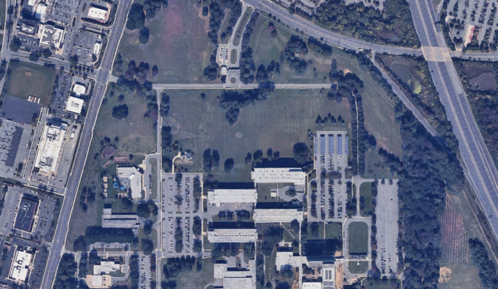

# randbeacon

a lights display that reads the values from NIST's Randomness Beacon

We are using the [NIST Randomness Beacon v2](https://csrc.nist.gov/projects/interoperable-randomness-beacons/beacon-20) which generates truly random bitstrings once a minute. 

> A “randomness beacon” is a timed source of public randomness. It pulsates fresh randomness at expected times, making it available to the public

I think its cool that theres something in this world called a beacon. [Heres an article about how they generate these, its quantum oooo fancy!!](https://www.nist.gov/news-events/news/2025/06/nist-and-partners-use-quantum-mechanics-make-factory-random-numbers) These are all generated at the NIST Information Technology Laboratory in Maryland.

### Usage

### The design

The randomness beacon is 512 bits long (64 bytes), and a new one is generated every minute. We have lights, and each light can display 3 8-bit values. We also have temporal resolution, and can display different lights at different times. We have, then, very little data and a large space to display it over.

To constrain ourselves, we can set boundaries. As this light is meant to be running continuously in a living or working space for humans, drastic brightness changes or strobing patterns should be avoided. Also, the perceptual space of super bright LEDs works best with highly saturated colors, so the whites and greys and muddy colors in the low saturation space can be avoided entirely.

I enjoy constant, slow motion on my light art, like a clock. I also want some new animation to show that there is a NEW value from the beacon. But it shouldn't be too distracting, and should play within the visual space of the light while being distinct.

I think the light should be somewhat dynamic. we could scan through values, and i think that could be cool. we have 64 bytes and 60 seconds in a minute. we could display one new value every second. On the minute, we could display a quick sequence of white on-offs for the current time. because seconds wont matter we can divide the unix time by 60 and then cast to 8 bits? and play them really rapidly.

| trait | brightness | hue |
| --- | ---       | --- |
| bit numbers | `1 2` | `3 4 5 6 7 8` |
| how to isolate | `value & 192` | `value & 63` |
| goal | evenly spaced value between 50% and 100% | evenly spaced value between 0% and 100% |
| method | `(isolate >> 1) + 159` | `isolate << 2` | 

